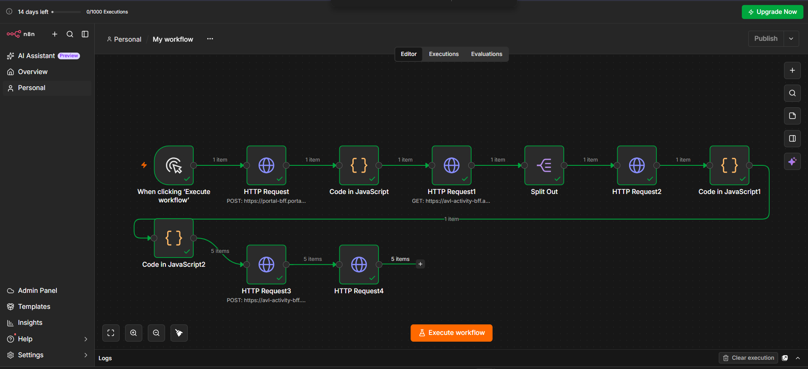
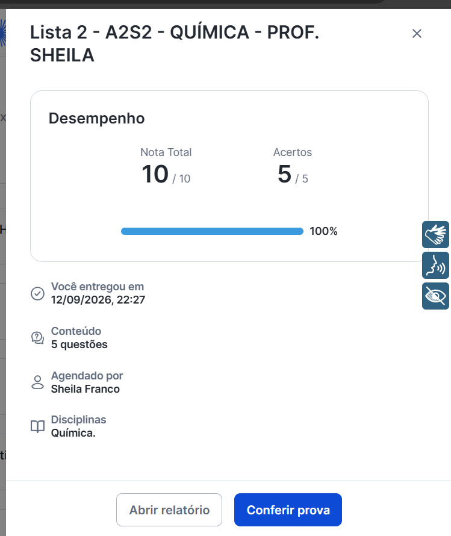
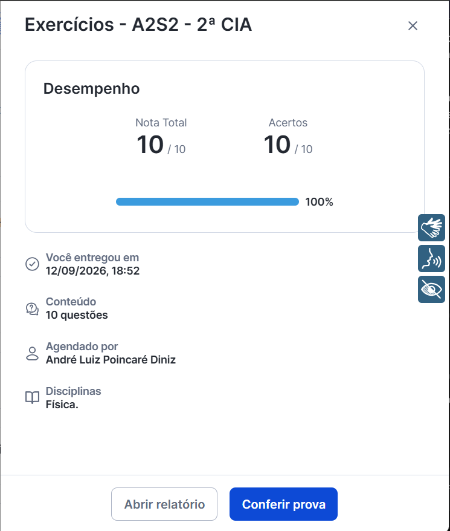

# n8n HTTP Batch Dispatcher & Workflow Utility

Este repositório armazena um modelo de fluxo de trabalho automatizado construído no **n8n** para fins de estudo de manipulação de requisições HTTP, paginação de dados e processamento em lote (*batch processing*).

---

## ⚠️ Isenção de Responsabilidade e Termos de Uso

**ESTE SOFTWARE É DISTRIBUÍDO EXCLUSIVAMENTE PARA FINS DE ESTUDO PESSOAL E PESQUISA TÉCNICA.**

* **Uso exclusivo por conta e risco:** Este código foi desenvolvido como um estudo de caso voltado para interação com APIs de plataformas de terceiros. Vale ressaltar que a análise dos Termos de Uso (ToS) da plataforma de destino não aponta restrições explícitas contra automações ou requisições via API. Ainda assim, o autor não presta suporte, não incentiva o uso indevido e **não assume qualquer responsabilidade** pela aplicação prática deste material por terceiros.
* **Autonomia e consequências:** Qualquer consequência, advertência ou penalidade decorrente da utilização deste script em ambientes externos é de inteira e exclusiva responsabilidade do usuário final. O autor exime-se de qualquer obrigação de assistência, suporte ou intervenção em caso de eventuais sanções ou bloqueios decorrentes da execução do código.

---

## 📋 Sobre o Projeto

Este repositório documenta uma arquitetura de integração e automação desenvolvida no **n8n**, projetada para demonstrar conceitos avançados de comunicação assíncrona, manipulação de payloads e engenharia de tráfego web. 

A esteira modular foi estruturada para operar em ciclos sequenciais e paralelos, contemplando os seguintes componentes técnicos:

* **Mapeamento Dinâmico de Variáveis:** Utilização de blocos de execução em JavaScript (`Code Nodes`) para isolar, extrair e normalizar propriedades de dados em tempo de execução, garantindo a interoperabilidade entre os nós da esteira.
* **Processamento de Requisições em Lote (*Batch Dispatch*):** Orquestração de disparos sequenciais para o envio automatizado de pacotes de dados via protocolo HTTP.
* **Tratamento de Respostas e Códigos de Status:** Gerenciamento de códigos de retorno de servidores REST, com validação de respostas padrão de sucesso — como o status HTTP `204 No Content` para confirmação de encerramento de instâncias.

## ⚙️ Como Utilizar em Laboratório

1. Importe o arquivo `SAS_educacao_otimizacao_n8n.json` em sua instância local do n8n.
2. Certifique-se de configurar adequadamente os parâmetros de autenticação e os identificadores de sessão necessários para que o payload simule corretamente as requisições de teste (utilizando credenciais válidas adaptadas ao seu ambiente de homologação).

## 🖼️ Visão Geral do Workflow

Abaixo está a representação visual da estrutura completa da esteira de automação configurada no n8n:

## 📊 Status de Execução (100% Concluído)

Aqui está a comprovação do disparo bem-sucedido e da conclusão de todas as atividades na interface de laboratório:

